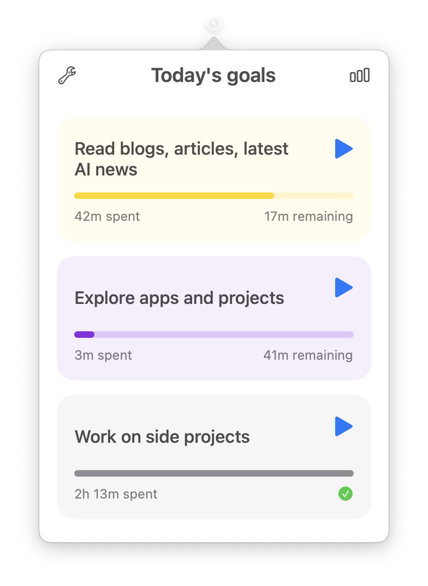
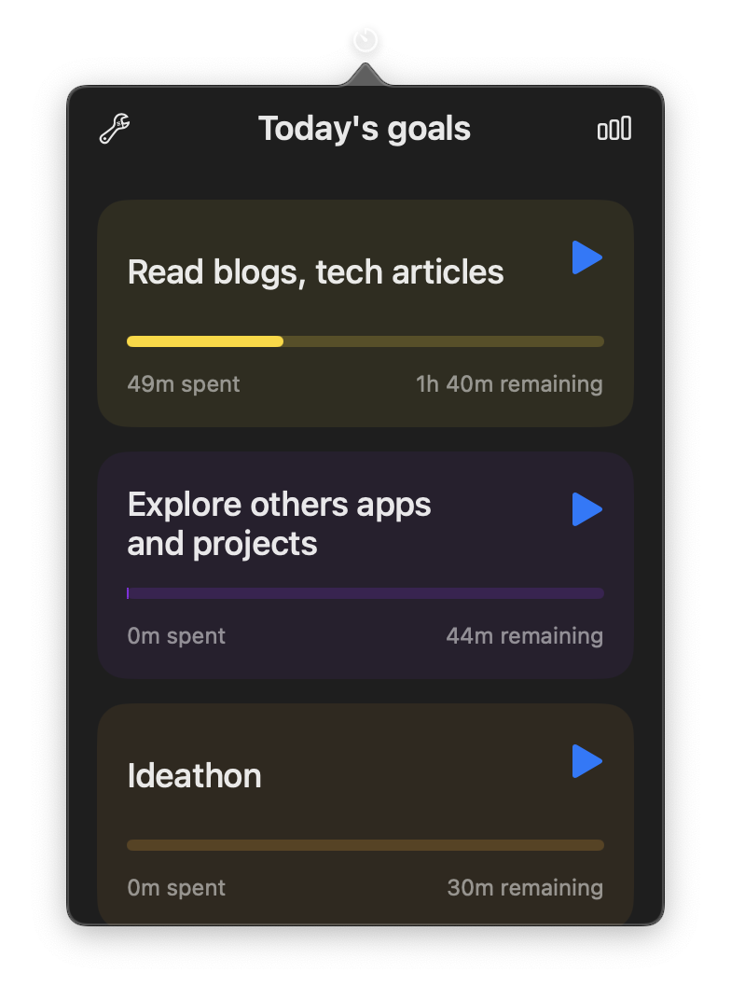

# TimeCraft

<p align="center">

</p>

<p align="center"> 
 

</p>

<p align="center">
    <a href="#features">Features</a> •
    <a href="#installation">Installation</a> •
    <a href="#contributing">Contributing</a> •
    <a href="#license">License</a>
  </p>

## Overview

<p align="center>

Are you spending enough time every day on the things that are important to you?

TimeCraft is a lightweight MacOS app that lives on the menubar. You can configure different goals that you want to spend time on everyday, and track their time.

You start/stop the timers from the menubar before starting your activity. And at the end of the day, review if you met your goals. For me this serves as a constant reminder to take out some time for certain things that are important but are easy to overlook.

</p>

<div align="center">
    
  
</div>

## Features

- All interactions through the macOS menu bar
- Create and configure goals with target durations
- Start/Stop timers on each goal with a single click
- View active goal and elapsed time directly in the menu bar
- Beautiful and intuitive interface for goal management
- Seamless background operation while you focus on your work
- Supports both light and dark mode


## Installation

### Direct Download

Direct downloads can be found on the [releases](https://github.com/bhrigu123/TimeCraft/releases) page.  
After downloading and extracting, just drag the _.app_ file to the _Applications_ folder.

### Building from Source

1. Clone the repository

```bash
git clone https://github.com/yourusername/TimeCraft.git
```

2. Open the project in Xcode

```bash
cd TimeCraft
open TimeCraft.xcodeproj
```

3. Build and run the project (⌘R)

## Contributing

Feel free to share, open issues and contribute to this project! ❤️

1. Fork the repository
2. Create your feature branch (`git checkout -b feature/AmazingFeature`)
3. Commit your changes (`git commit -m 'Add some AmazingFeature'`)
4. Push to the branch (`git push origin feature/AmazingFeature`)
5. Open a Pull Request

## License

This project is licensed under the terms of the MIT License.  
See [LICENSE](LICENSE) for details.

## About

I built TimeCraft because I kept running into this problem - there were things I really wanted to do every day, but they'd somehow always slip through the cracks. You know, those important-but-not-urgent things that are super easy to skip? I came across Cal Newport's method where he actually tracks his daily focus time and reviews it at the end of each day and week. So, TimeCraft was born. Whether you're trying to read more, write regularly, or just want to make sure you're spending enough time on things that matter to you, TimeCraft helps you keep track without getting in your way. For me, just seeing those timers in my menubar serves as a constant nudge to not skip the important stuff, and  hope it can do the same for you!

### Topics

macos • swift • menubar • productivity • time-tracking • goals • swiftui • macos-menubar • time-management
