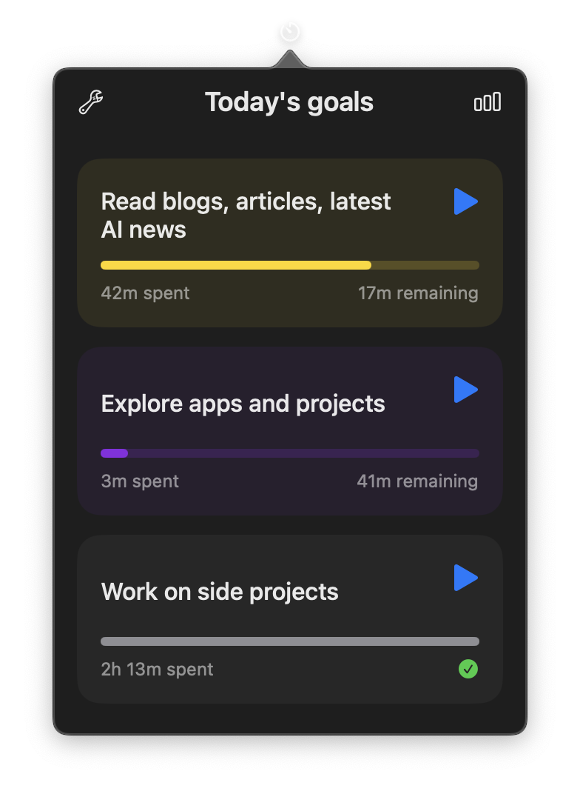

# TimeCraft

<p align="center">

</p>

<p align="center"> 
 

</p>

<p align="center">
    <a href="#features">Features</a> •
    <a href="#installation">Installation</a> •
    <a href="#contributing">Contributing</a> •
    <a href="#license">License</a>
</p>

## Overview

<p align="center">

Are you spending enough time every day on the things that matter?

TimeCraft is a lightweight MacOS app that lives on the menubar, and helps you track if you're giving enough time each day to the things that truly matter.
You can configure different goals that you want to spend time on everyday, and track their time.
Not just the urgent stuff, but the important things that are easy to skip.

I built this because I found myself constantly skipping things like deep work, or learning. Things that don't scream for attention, but shape who we become.

> *Inspired by Cal Newport's hour tally system.*


</p>

<div align="center">
    
  
</div>

## Features

- All interactions through the macOS menu bar
- Create and configure goals with target durations
- Start/Stop timers on each goal with a single click
- View active goal and elapsed time directly in the menu bar
- Intuitive interface for goal management
- Seamless background operation while you focus on your work
- Supports both light and dark mode


## Installation

### Direct Download

1. Downlod the TimeCraft `zip` file of the latest version from the [releases](https://github.com/bhrigu123/TimeCraft/releases) page.  
2. After downloading and extracting, just drag the `TimeCraft` app file to the _Applications_ folder.

### Building from Source

1. Clone the repository

```bash
git clone https://github.com/yourusername/TimeCraft.git
```

2. Open the project in Xcode

```bash
cd TimeCraft
open TimeCraft.xcodeproj
```

3. Build and run the project (⌘R)

## Contributing

Feel free to share, open issues and contribute to this project! ❤️

1. Fork the repository
2. Create your feature branch (`git checkout -b feature/AmazingFeature`)
3. Commit your changes (`git commit -m 'Add some AmazingFeature'`)
4. Push to the branch (`git push origin feature/AmazingFeature`)
5. Open a Pull Request

## License

This project is licensed under the terms of the MIT License.  
See [LICENSE](LICENSE) for details.

### Topics

macos • swift • menubar • productivity • time-tracking • goals • swiftui • macos-menubar • time-management
